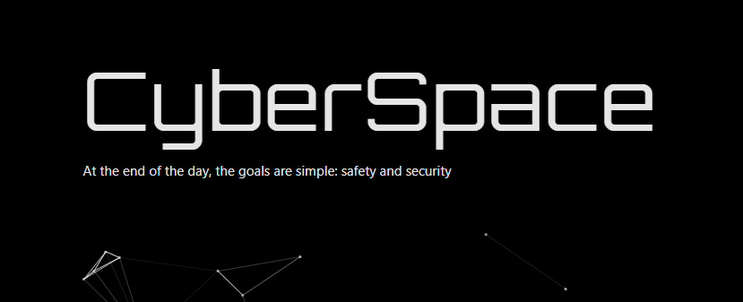
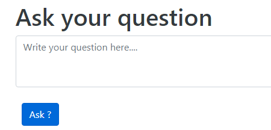
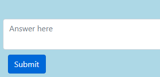
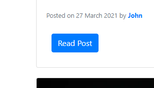
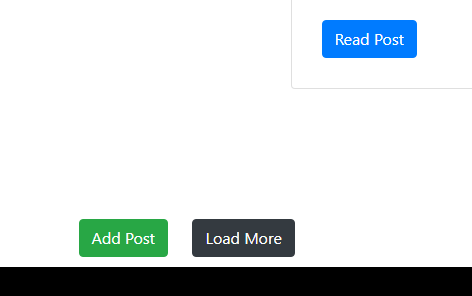
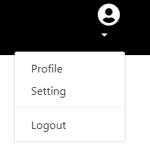

# CyberSpace

   **CyberSpace** is a forum app, that will build community of Cyber experts
and novice common people. Here people can share their experiences, ask questions to experts and there by create a massive awareness among the public. Cyber experts can share ways and tips to prevent common cyber attacks. People can get to know and learn from stories of people who have been victims of such cybercrimes and prevent themselves from being a victim.
> At the end of the day, the goals are simple: safety and security :closed_lock_with_key:

## Features
Once you register and login you can use the following features :

* ### Ask Questions and start a public Discussion :question:

You can ask your questions or advice and start a discussion. Cyber Experts and others who can help you will answer your questions. You can view all your questions in **History -> Questions** section.

* ### Help other users by Answering their Questions :heavy_check_mark:

You can answer questions posted by other users and help them clear their doubts. You can also advice them on how to solve their problems. You can view all your answers in **History -> Answers** section.

* ### Read Posts and Stories :pencil:

You can read informative posts put up by Cyber Experts and other users in the **Post & Stories** section and thereby increase your awareness in the cyber world. 

* ### Add Posts and Stories :writing_hand:

You can add your own post and stories for others to read and spread your knowledge and findings. To add your post click on **Add** button in the bottom of **Post & Stories** section.

* ### View Profiles and Contact :telephone_receiver:

You can view profiles of other users who have answered your questions or from their posts, know who they are, read their posts and contact them privately for any advice or help. To view profile click on their **username** besides the question answers or posts.

* ### View and Edit your Profile :paintbrush:

You can view and edit your profile details any time by going to **Profile logo -> Settings**.

## Technology Stack used :woman_technologist:
* HTML5, CSS, Javascript, jQuery, Bootstrap for Frontend
* PHP, MySql for Backend

##  Try out :smile:
Link: https://cyberspace101.000webhostapp.com/

You can use the following credentials to walkthrough the website
> username: martin369
> password: martin123
